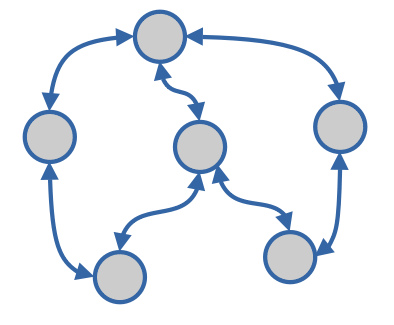

# dynamic lib
This is a kind of workflows library inspired by:
* [flow-based programming paradigm](https://en.wikipedia.org/wiki/Flow-based_programming)
* [railway programming pattern](https://naveenkumarmuguda.medium.com/railway-oriented-programming-a-powerful-functional-programming-pattern-ab454e467f31)

The idea is to provide an easy way to implement complex data flow processes, included splits and joins. To achieve that, this lib uses these elements that are described below.

## **Job** 
```go
    type Job func(context.Context, Postman)
``` 
Each **Job** implements a unique task in the *Flow*. It comunitcates with the rest of *Jobs* (parents and childs), by receiving and sending *Param* messages:
```go
    type Param struct {
    	Err   error
    	Name  string
    	Value interface{}
    }
```
To receive/send messages from/to its parents/children, each *Job* receives a **Postman** implementation:
```go
    type Postman interface {
	    Receive(ctx context.Context) (*Param, error)
	    Send(ctx context.Context, p Param) bool
    }
````
Neither of the two methods is a blocker. I mean that *Receive* method will return a nil param if there is not a message to be read from parents, and the *Send* method will return false if the message has not been sent. It can occur if the children are not still ready to receive it. But you are free to make them locker by wrapping them in an infinite loop until the message is read/sent.

## **Worker**
A *Worker* wrappers a *Job* to be indcluded and managed by a *Flow*. It is in charge of:
* Ensuring that the *Job* is up and running.
* Kill the *Job* when the flow is also killed.
* Connecting the *Job* with its parents and children.
* Provide messages from parents through the *Postman.Receive* method.
* Filter messages from parents if a filter has been provided. The filter is provided as an option to the *Worker* constructor.
```go
    type InFilterFunc func(Param) bool
```
* Sending output messages from the *Job* to its children through the *Postman.Send* method

## **Flow**
The *Flow* performs the flow role. It is provided with a list of workers. When it starts, all of its workers also start. And when it finishes, all of its worker finishes.

# Building a flow
These are the steps to flow to build a flow:
1. Coding the *Job* functions
2. Wrapping the *Jobs* into *Workers*
3. Defining the Flow
4. Adding the *Workers* to the *Flow*
5. Starting the *Flow*
6. If the *Flow* is not and endless one, kill it when it finishes.

See [Sorting flow example](./examples/sorting/README.md) and [tests](./workflow_test.go) to figure out how to code your own flows in a easy way. It's really easy to do thanks to [Go concurrency features](https://en.wikipedia.org/wiki/Go_(programming_language)#Concurrency:_goroutines_and_channels)

# Disclamer
**I've coded it only for fun**. Please read the [LICENSE](./LICENSE). I hope you enjoy using it as much as I enjoyed building it. All ideas are welcome. Please let me know what you would add or change.

# TODO
* Adding more examples