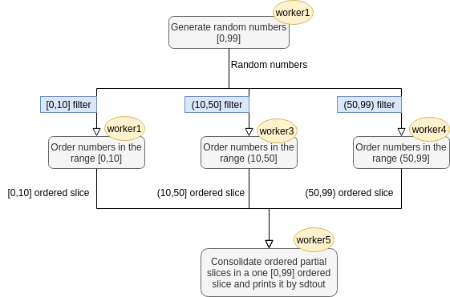

# Sorting example
This is a sorting flow example. This flow is composed by three jobs and five workers:

1. **Random generator job**: It generates a random sequence of integers in the range [0,99]. This job implements the *worker1*

2. **Order job**: It orders a list of integers. This job implements the workers *worker2*, *worker3*, and *worker4*. Each one of these workers is in charge of ordering a specific range of integers. So, each worker only receives the integers that belong to its range. To achieve it, we add a filter func to them. In this way, it gets the integers from *worker1* that the filter does not discard and orders them in a slice. When it already has received all the integers, it outputs its ordered slice of integers to *worker4*.

3. **Consolidate a ordered slice from 0 to 99 job**: This funcions implements the *worker5*. It waits for receive the ordered slice from workers 2,3 and 4, and then order them in a one unique slice. 

